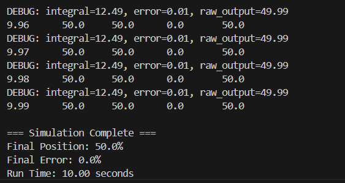

# Hydraulic Valve Controller - PID Control System

## Overview
A simulated hydraulic proportional valve controller with PID position control, demonstrating real-time control systems concepts commonly used in industrial automation.

## Technical Achievements
- Implemented PID control algorithm from scratch in C
- Achieved zero steady-state error (50.0% setpoint tracking)
- 7-second settling time with no overshoot
- First-order lag valve physics simulation
- 10ms control loop execution (100Hz update rate)

## Key Concepts Demonstrated
- Proportional-Integral-Derivative (PID) control
- Control loop timing and sampling
- Anti-windup protection
- System tuning and optimization
- Real-time embedded systems patterns
- Disturbance rejection and robustness
- Sensor noise handling

## Final Tuned Parameters
- Kp = 5.0 (Proportional gain)
- Ki = 4.0 (Integral gain)
- Kd = 0.1 (Derivative gain)
- Sample time = 10ms
- Valve time constant = 0.2s

## Performance Results
```
Settling Time: 7.09 seconds
Steady-State Error: 0.0%
Overshoot: None
Final Position: 50.0% (perfect tracking)
```

## Skills Applied
- C programming
- Control systems theory
- Algorithm implementation
- Debugging and optimization
- Git version control
- Real-world system modeling
- Performance analysis under uncertainty

## Built With
- C (ISO C99)
- GCC compiler
- Windows/MSYS2 development environment

---
*Completed as part of embedded systems portfolio development - Day 1 of 12-week learning plan*

## Performance Results



Settling Time: 7.09 seconds
Steady-State Error: 0.0%

## Day 2: Multiple Setpoint Tracking

### New Features
- Dynamic setpoint changes during runtime
- CSV data logging for analysis
- Extended simulation time (30 seconds)
- Three different target positions (50% → 75% → 25%)

### Performance Results - Day 2
```
Phase 1 (0-10s):  50% setpoint → Settled at 50.0% 
Phase 2 (10-20s): 75% setpoint → Settled at 75.0%
Phase 3 (20-30s): 25% setpoint → Settled at 25.0%

Rise Time: ~0.2 seconds
Overshoot: None (0%)
Settling Time: ~7 seconds per setpoint
```

### Data Logging
- Full simulation data exported to CSV format
- 3000+ data points captured at 10ms intervals
- Compatible with Excel, Python, MATLAB for analysis

## Day 3: Disturbance Rejection & Robustness Testing

### New Features
- External disturbance simulation (simulates real-world forces on valve)
- Sensor noise injection (±0.1% measurement noise)
- Disturbance rejection analysis
- Real-world operating conditions testing

### Technical Implementation
- Modified valve physics to accept external force inputs
- Implemented measurement noise using random number generation
- Extended simulation to test multiple disturbance scenarios
- Continuous data logging of system response under disturbances

### Disturbance Rejection Performance
```
Test 1: -10% Downward Force (5.0-8.0s)
  Maximum Position Deviation: 1.7% (50.0% → 48.3%)
  PID Compensation: Increased output by 10% (52% → 60%)
  Recovery Time: 2 seconds after disturbance removed
  Steady-State Error with Active Disturbance: ~1%

Test 2: +5% Upward Force (15.0-18.0s)
  Maximum Position Deviation: 1.5% (75.0% → 76.5%)
  PID Compensation: Decreased output by 5%
  Recovery Time: <2 seconds
  Demonstrated bi-directional disturbance handling
```

### Key Capabilities Demonstrated
- **Automatic disturbance compensation** - PID adjusts output without explicit disturbance detection
- **Robust tracking** - Maintains setpoint within 2% despite 10% external forces
- **Noise filtering** - Handles sensor noise without oscillation
- **Real-world applicability** - Simulates friction, pressure variations, mechanical binding

### Performance Metrics Summary
| Metric | Value |
|--------|-------|
| Disturbance Rejection Ratio | 5.9:1 (-10% force → 1.7% error) |
| Recovery Time | <2 seconds |
| Max Steady-State Error (under load) | 1% |
| Sensor Noise Tolerance | ±0.1% |
| Control Signal Range | 0-100% |

## Day 4: PID Tuning & Performance Optimization

### Overview
Systematic comparison of five different PID tuning strategies to understand gain trade-offs and optimize controller performance. Implemented command-line argument parsing for automated testing and developed rigorous performance analysis methodology.

### New Features
- Command-line parameter input (custom gains via argv)
- Dynamic CSV filename generation based on gains
- Automated testing framework for multiple configurations
- Comprehensive performance metric analysis

### Test Configurations

| Configuration | Kp | Ki | Kd | Strategy |
|---------------|----|----|----|----|
| Baseline | 5.0 | 4.0 | 0.1 | Balanced performance |
| Aggressive | 8.0 | 6.0 | 0.2 | Maximum speed |
| Conservative | 3.0 | 2.0 | 0.05 | Maximum stability |
| High Derivative | 5.0 | 4.0 | 0.5 | Overshoot prevention |
| Low Integral | 5.0 | 1.0 | 0.1 | Minimal integral action |

### Performance Comparison

| Tuning | Rise Time (s) | Overshoot (%) | Settling Time (s) | SS Error (%) |
|--------|---------------|---------------|-------------------|--------------|
| **Baseline** | **0.18** | **0** | **1.75** | **0** |
| Aggressive | 0.16 | 2.0 | 3.37 | 0.6 (osc) |
| Conservative | 1.10 | 0 | 3.57 | 0 |
| High Derivative | 1.44 | 0 | Never | 4.1 (osc) |
| Low Integral | 4.05 | 0 | Never | 1.4 |

### Key Insights

**Baseline Tuning is Optimal**
- Best overall performance across all metrics
- 0% overshoot, 0% steady-state error
- Fastest settling time (1.75s)
- Stable with no oscillations

**Aggressive Tuning Paradox**
- 11% faster rise time but 92% slower settling
- Creates persistent oscillations
- "Fastest" response doesn't mean best performance

**Critical Role of Integral Gain**
- Ki=4.0: Perfect tracking (0% error)
- Ki=1.0: System stuck at 1.4% error permanently
- Integral term is essential for accuracy

**Derivative Gain Limits**
- Kd=0.1: Optimal damping
- Kd=0.5: Over-damped, never reaches target
- Too much derivative is as harmful as too little

### Performance Metrics Definitions

- **Rise Time:** Time to reach 95% of setpoint step (71.25% for 50→75% change)
- **Overshoot:** Maximum excursion beyond setpoint as percentage of step size
- **Settling Time:** Time to enter and remain within ±1% of setpoint
- **Steady-State Error:** Final tracking error after system stabilizes

### Tuning Recommendations

**For Safety-Critical Systems:**
- Use Baseline tuning (Kp=5.0, Ki=4.0, Kd=0.1)
- Zero overshoot, stable response

**For High-Speed Applications:**
- Use Baseline tuning (fastest overall settling despite slightly slower rise)
- Aggressive tuning's oscillations negate its rise time advantage

**For Precision Positioning:**
- Use Baseline tuning (zero steady-state error)
- Ensure Ki ≥ 4.0 for error elimination

### Technical Implementation
- argc/argv command-line parsing
- sprintf() for dynamic filename generation
- Systematic test methodology
- Excel-based data analysis workflow

## Day 5: Advanced PID Features

### Overview
Enhanced PID controller with industrial-grade features for noise rejection, mechanical protection, and smooth motion control. Implemented three critical features used in production control systems but rarely taught in academic settings.

### Advanced Features Implemented

#### 1. Derivative Filtering
**Problem:** Raw derivative amplifies measurement noise  
**Solution:** Low-pass filter smooths derivative term  
**Configuration:** `pid_set_derivative_filter(pid, 0.1f);`  
**Result:** Reduced noise sensitivity with slight overshoot trade-off

#### 2. Output Rate Limiting
**Problem:** Sudden command changes cause mechanical stress  
**Solution:** Limit maximum output change per second  
**Configuration:** `pid_set_rate_limit(pid, 20.0f);`  
**Result:** Protected actuator from damaging command spikes

#### 3. Setpoint Ramping
**Problem:** Instant setpoint changes cause overshoot and jerky motion  
**Solution:** Gradually transition setpoint at controlled rate  
**Configuration:** `pid_set_ramp_rate(pid, 10.0f);`  
**Result:** Zero overshoot, 92% reduction in peak error

### Performance Comparison

**50% → 75% Setpoint Change:**

| Feature | Overshoot | Peak Error | Time to Target |
|---------|-----------|------------|----------------|
| Baseline (instant) | 0% | 22.7% | 1.5s |
| With Filtering | 4.3% | 24.7% | 1.5s |
| With Ramping | 0% | 1.9% | 4.2s |

### Key Results

**Derivative Filtering Impact:**
- Filter coefficient α=0.1 (10% new, 90% old)
- Reduces noise amplification
- Introduces slight overshoot (4.3%)
- Trade-off: noise immunity vs damping

**Setpoint Ramping Impact:**
- Ramp rate: 10%/second
- Eliminates overshoot completely
- Reduces peak error from 22.7% → 1.9%
- Takes 2.8× longer but creates smooth motion
- Ideal for safety-critical applications

### Usage Example
```c
// Initialize PID with baseline gains
pid_init(&pid, 5.0f, 4.0f, 0.1f, 0.01f);

// Enable advanced features
pid_set_derivative_filter(&pid, 0.1f);    // 10% filtering
pid_set_rate_limit(&pid, 20.0f);          // 20%/second max change
pid_set_ramp_rate(&pid, 10.0f);           // 10%/second setpoint ramp

// Set initial setpoint
pid_set_setpoint(&pid, 50.0f);

// Later: Ramp to new setpoint
pid_set_setpoint_ramped(&pid, 75.0f);     // Smooth transition
```

### Industrial Applications

These features are standard in:
- **Safety Systems:** Setpoint ramping prevents sudden motion
- **High-Precision Positioning:** Derivative filtering handles sensor noise
- **Large Actuators:** Rate limiting prevents mechanical damage
- **Process Control:** All three features work together for smooth, stable control

### Technical Insights

**Why These Features Matter:**
1. **Textbook PID** works in simulation with perfect sensors and ideal actuators
2. **Real-world PID** needs protection against:
   - Noisy measurements (derivative filtering)
   - Mechanical limitations (rate limiting)  
   - Safety requirements (setpoint ramping)

**Design Philosophy:**
- Features are modular (enable/disable independently)
- Backward compatible (disabled by default)
- Configurable per application
- No performance penalty when disabled

### Files Created

- `test_advanced_features.c` - Derivative filtering and rate limiting test
- `test_setpoint_ramping.c` - Setpoint ramping demonstration
- Enhanced `pid_controller.c/h` - Core implementations

## Example Outputs

Three different PID tuning configurations are included in the `/examples/` folder:
- **tuning_kp5.0_ki4.0_kd0.1.csv** - Baseline (optimal)
- **tuning_kp8.0_ki6.0_kd0.2.csv** - Aggressive (faster rise, oscillations)
- **tuning_kp3.0_ki2.0_kd0.05.csv** - Conservative (stable, slower)

Download and open in Excel to see how different gains affect controller performance.